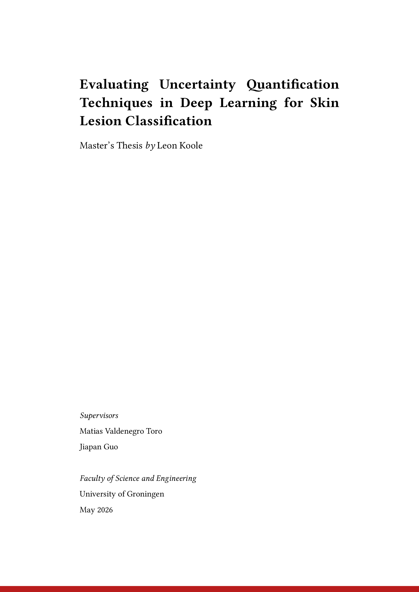
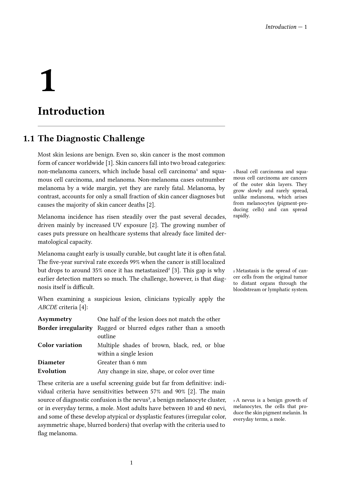
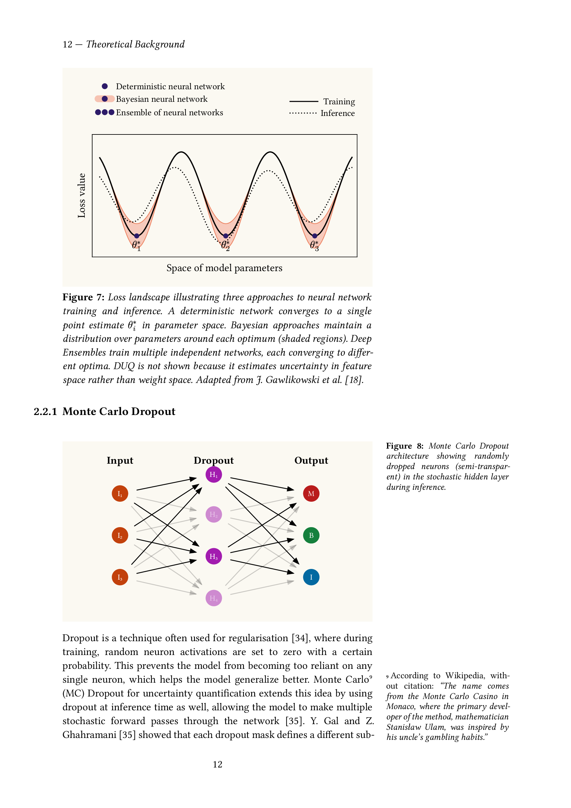
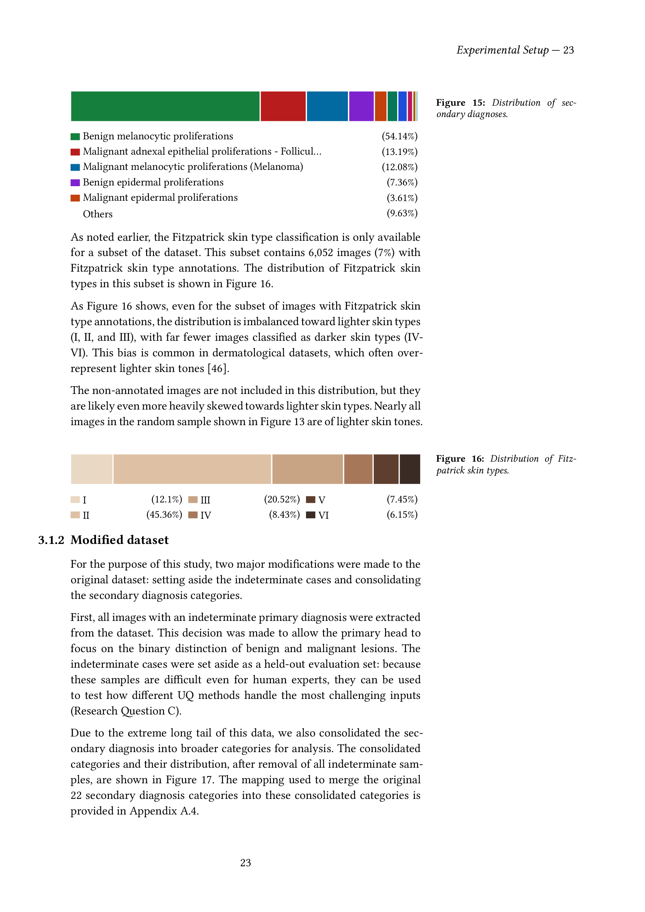
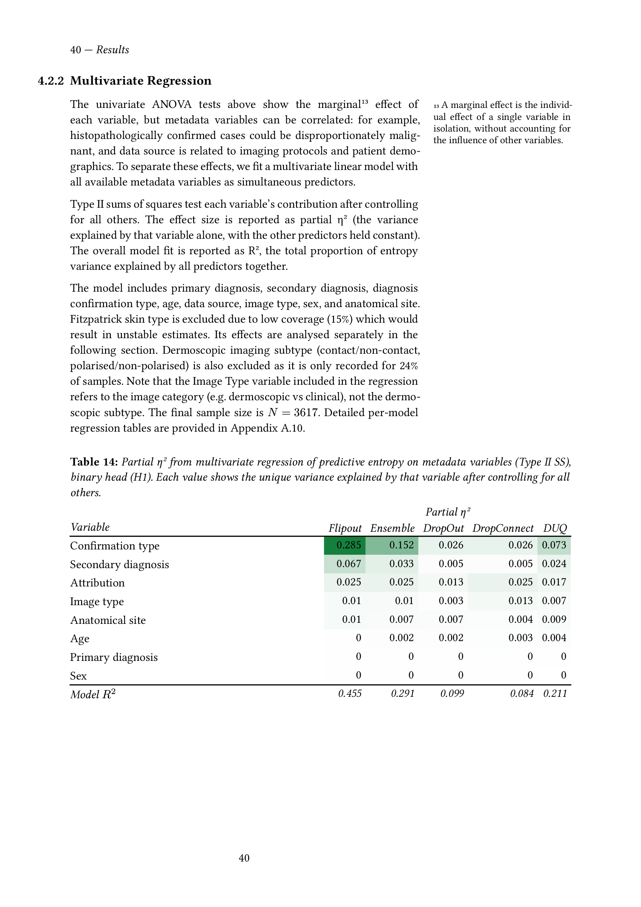
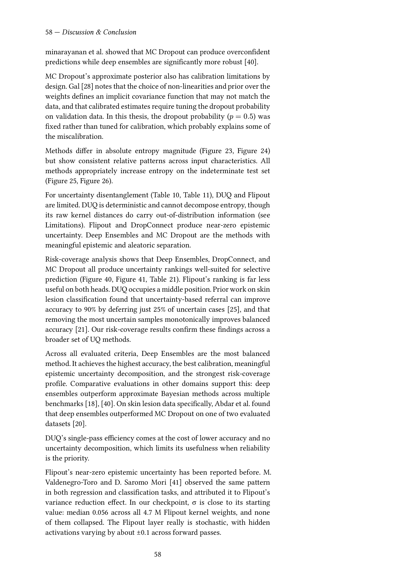

# Thesis submission

Master's thesis **Evaluating Uncertainty Quantification Techniques in Deep
Learning for Skin Lesion Classification** by Leon Koole, University of
Groningen.

## Quick links

- [`thesis_compressed.pdf`](thesis_compressed.pdf) — final compiled PDF
- [`Thesis/thesis.typ`](Thesis/thesis.typ) — main thesis source
- [`Thesis/template.typ`](Thesis/template.typ) — document template

## Preview

| Page 1 | Page 10 |
| :---: | :---: |
|  |  |
| **Page 21** | **Page 32** |
|  |  |
| **Page 49** | **Page 67** |
|  |  |

## Compile

From this directory:

```sh
typst compile Thesis/thesis.typ Thesis/thesis.pdf --root .
```

Optionally compress the output (matches `thesis_compressed.pdf`, it's 140MB otherwise):

```sh
gs -sDEVICE=pdfwrite -dPDFSETTINGS=/printer -dNOPAUSE -dBATCH \
   -sOutputFile=thesis_compressed.pdf Thesis/thesis.pdf
```

## Dependencies

Typst will download the following packages on first compile (internet required):

- `@preview/marginalia:0.2.3`
- `@preview/fletcher:0.5.8`
- `@preview/oxifmt:1.0.0`
- `@preview/cetz:0.4.0`

`lilaq` is embedded under `Thesis/lilaq/` and needs no download. The
violin plots used throughout this thesis were implemented as part of this
work and have since been contributed back upstream to the lilaq project.
